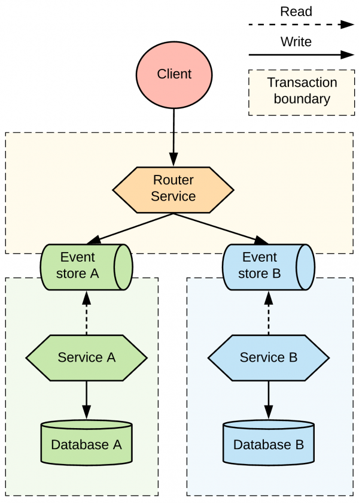

> 翻译自文章: [Distributed transaction patterns for microservices compared](https://developers.redhat.com/articles/2021/09/21/distributed-transaction-patterns-microservices-compared#)，作者 [Bilgin Ibryam](https://developers.redhat.com/authors/bilgin-ibryam)

作为 Red Hat 公司的咨询架构师，我有幸参与了大量的客户项目。每个客户都会带来自己的挑战，但我发现了一些共同点。大多数客户想知道的一件事是，如何协调对多个记录系统的写入。回答这个问题通常涉及到对双重写入（dual writes）、分布式事务、现代替代方案以及每种方法可能出现的故障情况和缺点的长篇解释。通常情况下，这时客户会意识到，将单体应用拆分为微服务是一个漫长而复杂的过程，而且通常需要权衡。

本文没有深入讨论事务的细节，而是总结了协调向多个资源写入的主要方法和模式。我知道，你可能对这些方法中的一种或多种有好的或坏的过往经验。但在实践中，在正确的环境和正确的约束条件下，所有这些方法都能正常工作。技术带头人负责选择适合他们环境的最佳方法。

注意：如果你对双写感兴趣，请观看我在2021年红帽峰会上的演讲，在那里我深入地介绍了 [双重写入的挑战](https://events.summit.redhat.com/widget/redhat/sum21/sessioncatalog/session/1607126048915001oL4X)。你也可以略过我演讲中的幻灯片。目前，我参与了红帽 OpenShift Streams for Apache Kafka，这是一个完全托管的Apache Kafka服务。它只需要不到一分钟就能启动，而且在试用期内完全免费。请试一试，并通过您的早期反馈帮助我们塑造它。如果你对本文有疑问或意见，请在Twitter上联系我@bibryam，让我们开始吧。

## 双重写入问题

表明你可能有双重写入问题的唯一指标是需要可预测地写入多个的记录系统。这个需求可能并不明显，在分布式系统设计过程中，它可以用不同的方式表达。比如说：

- 你已经为每项工作选择了最好的工具，现在你必须更新NoSQL数据库、搜索索引和缓存，作为单一业务事务的一部分。
- 你所设计的服务必须更新它的数据库，同时向另一个服务发送关于该变化的通知。
- 你有跨越多个服务边界的业务事务。
- 你可能不得不将服务操作实现为幂等的，因为消费者必须重试失败的调用。

在这篇文章中，我们将使用一个示例场景来评估处理分布式事务中的双重写入的各种方法。我们的场景是一个客户端应用程序，它调用另一个微服务执行修改操作。Service A必须更新它的数据库，但它也必须调用服务B执行写操作，如图1所示。数据库的实际类型，服务与服务之间的交互协议，与我们的讨论无关，因为问题仍然是一样的。

图1：微服务中的双重写入问题

一个小但关键的澄清解释了为什么这个问题没有简单的解决方案。如果服务A写到它的数据库，然后将通知发送到服务B的队列中（让我们称之为 *local-commit-then-publish*  方法），应用程序仍然有可能无法可靠地工作。当服务A写到它的数据库，然后将消息发送到队列时，有一个小概率，即应用程序在提交到数据库后和第二次操作前崩溃，这将使系统处于不一致的状态。如果消息是在写入数据库之前发送的（我们称这种方法为 *publish-then-local-commit* ），就有可能出现数据库写入失败或时间问题，即服务B在服务A向其数据库提交变更之前收到事件。无论哪种情况，这种情况都涉及到对数据库和队列的双重写入，这就是我们要探讨的核心问题。在接下来的章节中，我将讨论目前针对这一始终存在的挑战的各种实现方法。

## 模块化单体

将应用程序开发成模块化的单体，可能看起来像一个黑客，或者是在架构演进中倒退，但我看到它在实践中运行良好。它不是一种微服务模式，而是微服务规则的一个例外，可以谨慎地与微服务相结合。当强大的写入一致性是驱动需求，甚至比独立部署和扩展微服务的能力更重要时，那么你可以采用模块化的单体架构。

拥有单体架构并不意味着系统的设计很差或不好。它并不说明什么质量问题。顾名思义，它是一个以模块化方式设计的系统，正好有一个部署单元。请注意，这是一个有目的的设计和实现的模块化单体，它不同于一个意外创建的、随时间增长的单体。在一个有目的的模块化单体架构中，每个模块都遵循微服务原则。每个模块都封装了对其数据的所有访问，但操作是以内存内的方法调用的方式暴露和消费的。

### 模块化单体的架构

采用这种方法，你必须将两个微服务（服务A和服务B）转换为可以部署到共享运行时的库模块。然后你让两个微服务共享同一个数据库实例。因为这些服务被写成库并部署在一个共同的运行时中，所以它们可以参与相同的事务。因为这些模块共享一个数据库实例，你可以使用一个本地事务来一次性提交或回滚所有的变化。围绕部署方法也有不同，因为我们希望模块作为库部署在一个更大的部署中，并参与现有的事务。

即使在单体架构中，也有一些方法可以隔离代码和数据。例如，你可以将模块隔离到独立的包、构建模块和源代码库中，它们可以由不同的团队拥有。你可以通过命名规则、模式、数据库实例、甚至数据库服务器对表进行分组来实现部分数据隔离。图2中的图表是受Axel Fontaine关于 [雄伟的模块化单体](https://www.youtube.com/watch?v=BOvxJaklcr0) 的演讲启发，说明了应用程序中不同的代码和数据隔离级别。

图2：应用程序的代码和数据隔离的级别

拼图的最后一块是使用一个运行时和一个能够消费其他模块的包装器服务，并将其纳入现有事务的上下文中。所有这些限制使得模块比典型的微服务更紧密地耦合，但好处是包装器服务可以启动一个事务，调用库模块来更新它们的数据库，并作为一个操作来提交或回滚事务，而不必担心部分失败或最终的一致性。

在我们的例子中，如图3所示，我们将服务A和服务B转换为库，并将它们部署到一个共享运行时中，或者其中一个服务可以作为共享运行时。来自数据库的表也共享一个数据库实例，但它被分离为一组由各自的库服务管理的表。

图3：带有共享数据库的模块化单体

### 模块化单体的好处和坏处

在某些行业，事实证明这种架构的好处远比其他地方高度重视的更快的交付和变革步伐要重要得多。表1总结了模块化单体架构的优点和缺点。

> 表1：模块化单体架构的优点和缺点。

| **优点** | 简单的事务语义与本地事务确保了数据的一致性、自读自写、回滚，等等。 |
| -------- | ------------------------------------------------------------ |
| **缺点** | 共享运行时使我们无法独立部署和扩展模块，也无法进行故障隔离。单一数据库中的表的逻辑分离并不强。随着时间的推移，它可以变成一个共享的集成层。模块耦合和共享事务环境需要在开发阶段进行协调，并增加服务之间的耦合。 |
| **示例** | 诸如 Apache Karaf 和 WildFly 这样的运行时，允许服务的模块化和动态部署。Apache Camel的 `direct` 和 `direct-vm` 组件允许为内存调用暴露操作，并在JVM进程中保留事务上下文。Apache Isis 是模块化单体架构的最佳例子之一。它通过为你的Spring Boot应用程序自动生成UI和REST APIs来实现领域驱动的应用开发。Apache OFBiz 是模块化单体和面向服务架构（SOA）的另一个例子。它是一个全面的企业资源规划系统，有数百个表和服务，可以实现企业业务流程的自动化。尽管它的规模很大，但它的模块化架构使开发人员能够快速了解和定制它。 |

分布式事务通常是最后的手段，在各种情况下使用:

- 当对不同的资源的写入不能做到最终一致时。
- 当我们必须写到异质数据源时。
- 当需要 exactly-once 的消息处理，并且我们不能重构系统并使其操作具有幂等时。
- 当与第三方黑盒系统或实现两阶段提交规范的遗留系统集成时。

在所有这些情况下，当可扩展性不是一个问题时，我们可以考虑将分布式事务作为一个选择。

## 实现两阶段提交的架构

两阶段提交的技术要求是，你需要一个分布式事务管理器，如 Narayana 和一个可靠的事务日志存储层。你还需要与DTP XA 兼容的数据源，以及能够参与分布式事务的相关 XA 驱动，如 RDBMS、消息代理和缓存。如果你幸运地拥有合适的数据源，但运行在动态环境中，如Kubernetes，你还需要一个类似 operator 的机制来确保分布式事务管理器只有一个实例。事务管理器必须是高可用的，并且必须始终能够访问事务日志。

对于实现，你可以探索 Snowdrop 恢复控制器，它使用 Kubernetes StatefulSet 模式来实现单例目的，并使用持久化卷来存储事务日志。在这个类别中，我还包括SOAP web service 的 web services 原子事务 （WS-AtomicTransaction）等规范。所有这些技术的共同点是，它们实现了XA规范，并有一个中央事务协调器。

在我们的例子中，如图4所示，服务A正在使用分布式事务来提交对其数据库的所有更改，并将一条消息送到队列中，而不给重复或丢失的消息留下任何机会。同样地，服务B可以使用分布式事务来消费消息，并在一个没有任何重复的事务中向数据库B提交。或者，服务B可以选择不使用分布式事务，而是使用本地事务并实现空闲的消费者模式。为了记录在案，本节的一个更合适的例子是使用WS-AtomicTransaction来协调在单个事务中对数据库A和数据库A的写入，并完全避免最终一致性。但是现在这种方法比我所描述的更不常见。

图4：数据库和消息代理之间的两阶段提交跨度

### 两阶段提交架构的优势和劣势

两阶段提交协议提供了与模块化单体方法中的本地事务类似的保证，但有一些例外。因为在一个原子更新中涉及到两个或更多的独立数据源，它们可能会以不同的方式失败并阻塞事务。但由于它的中央协调器，与我将要讨论的其他方法相比，仍然很容易发现分布式系统的状态。

表2总结了这种方法的好处和坏处。

优点：基于标准的方法，具有开箱即用的事务管理器并支持数据源。为顺利的场景提供强大的数据一致性。

缺点：

* 可扩展性限制。
* 当事务管理器失败时，可能会出现恢复失败。
* 有限的数据源支持。
* 动态环境中的存储和单例要求。

示例：

- [Jakarta Transactions API](https://en.wikipedia.org/wiki/Java_Transaction_API) (原Java Transaction API)
- WS-AtomicTransaction
- JTS/IIOP
- eBay的[GRIT](https://tech.ebayinc.com/engineering/grit-a-protocol-for-distributed-transactions-across-microservices/)
- Atomikos
- Narayana
- 消息中介，如Apache ActiveMQR
- 实现XA规范的远程数据源，内存数据存储，如Infinispan

## 协调

对于模块化的单体，我们使用本地事务，我们总是知道系统的状态。通过基于两阶段提交协议的分布式事务，我们也能保证状态的一致性。唯一的例外是涉及事务协调者的不可恢复的故障。但是，如果我们想在了解整个分布式系统的状态并从一个地方进行协调的同时减轻一致性的要求呢？在这种情况下，我们可以考虑一种协调方法，其中一个服务作为整个分布式状态变化的协调者和编排者。协调者服务有责任调用其他服务，直到它们达到所需的状态，或者在它们失败时采取纠正措施。协调器使用其本地数据库来跟踪状态变化，它负责恢复与状态变化有关的任何故障。

### 实现协调架构

协调技术最流行的实现方式是 BPMN 规范的实现，如 jBPM 和 Camunda 项目。对这种系统的需求并不会因为微服务或 serverless 等过于分布式的架构而消失，相反，这种需求会增加。为了证明这一点，我们可以看看较新的有状态协调引擎，这些引擎不遵循规范，但提供类似的有状态行为，如Netflix的 Conductor、Uber 的 Cadence 和 Apache 的 Airflow。serverless 的有状态函数，如 Amazon StepFunctions、Azure Durable Functions 和 Azure Logic Apps，也属于这一类。还有一些开源库允许实现有状态的协调和回滚行为，如 Apache Camel 的 Saga 模式实现和 NServiceBus 的 Saga 能力。许多实现 Saga 模式的自制系统也属于这一类别。

图 5：协调两个服务之间的分布式事务

在图 5 所示的示例图中，我们让服务 A 充当有状态的协调者，负责调用服务 B 并在需要时通过补偿操作从故障中恢复。这种方法的关键特征是，服务A和服务B有本地事务边界，但是服务A有协调整个交互流程的知识和责任。这就是为什么它的事务边界触及服务B的端点。在实现方面，我们可以用同步交互来设置，如图所示，或者在服务之间使用一个消息队列（在这种情况下，你也可以使用两阶段提交）。

### 协调的好处和坏处

协调是一种最终一致的方法，可能涉及重试和回滚，以使分布进入一致状态。虽然它避免了对分布式事务的需求，但协调要求参与的服务提供幂等的操作，以防协调者不得不重试某个操作。参与的服务还必须提供恢复端点，以防协调者决定回滚并修复全局状态。这种方法的最大优点是能够通过仅使用本地事务来驱动可能不支持分布式事务的异构服务进入一致状态。协调者和参与的服务只需要本地事务，并且总是可以通过询问协调者发现系统的状态，即使它处于部分一致的状态。做到这一点，在我将要描述的其他方法中是不可能的。

表3：协调的优点和缺点。

优点：

- 协调异构分布式组件之间的状态。
- 不需要XA事务。
- 在协调者层面上已知的分布式状态。

缺点：

- 复杂的分布式编程模型。
- 可能需要参与服务的幂等性和补偿性操作。
- 最终的一致性。
- 补偿过程中可能出现无法恢复的故障。

示例：

- jBPM
- Camunda
- MicroProfile [Long Running Actions](https://github.com/eclipse/microprofile-lra)
- Conductor
- Cadence
- Step Functions
- Durable Functions
- Apache Camel Saga pattern implementation
- NServiceBus Saga pattern implementation
- The CNCF [Serverless Workflow](https://serverlessworkflow.io/) specification
- Homegrown implementations

## 编排

正如你在迄今为止的讨论中所看到的，一个单一的业务操作可能会导致服务间的多次调用，而且在一个业务交易被端到端处理之前可能需要不确定的时间。为了管理这一点，协调模式使用一个集中的控制器服务，告诉参与者该做什么。

协调的另一个选择是编排，这是一种服务协调的风格，参与者在其中交换事件而没有集中的控制点。通过这种模式，每个服务执行本地事务，并发布触发其他服务的本地事务的事件。系统的每个组件都参与关于业务交易工作流程的决策，而不是依赖一个中央控制点。历史上，编排方法最常见的实现是使用异步消息层进行服务交互。图6说明了编排模式的基本架构。

图6：通过消息传递层的服务编排

### 双重写入的编排

为了使基于消息的编排发挥作用，我们需要每个参与服务执行一个本地事务，并通过向消息基础设施发布命令或事件来触发下一个服务。同样地，其他参与的服务必须消费消息并执行一个本地事务。这本身就是一个更高层次的双写问题中的一个双写问题。当我们开发一个具有双写的消息层来实现编排方法时，我们可以把它设计成一个跨越本地数据库和消息代理的两阶段提交。我在前面介绍过这种方法。另外，我们也可以使用  *publish-then-local-commit* or *local-commit-then-publish* 的模式。

- **Publish-then-local-commit**：我们可以尝试先发布一个消息，然后再提交一个本地事务。虽然这个方案听起来不错，但它有实际的挑战。例如，很多时候你需要发布一个由本地事务提交产生的ID，而这个ID将不能用于发布。另外，本地事务可能会失败，但我们不能回滚发布的消息。这种方法缺乏读写语义，对于大多数用例来说，它是一种不切实际的解决方案。
- 本**Local-commit-then-publish**：一个稍好的方法是先提交本地事务，然后再发布消息。这有一个小概率的失败发生在本地事务提交之后和发布消息之前。但即使在这种情况下，你也可以把你的服务设计成幂等的并重试操作。这将意味着再次提交本地事务，然后再发布消息。如果你控制了下游的消费者，并且能让他们也成为幂等，那么这种方法就能发挥作用。总的来说，这也是一个相当好的实现方案。

### 没有双重写入的编排

实现编排架构的各种方法都限制了每个服务只能通过本地事务写到一个单一的数据源，而不是其他地方。让我们看看在没有双重写入的情况下如何工作。

假设服务A收到一个请求并把它写到数据库A，而不是其他地方。服务B定期轮询服务A并检测新的变化。当它读到变化时，服务B用变化和索引或时间戳来更新它自己的数据库，直到它接收到变化为止。这里的关键部分是，两个服务都只写到自己的数据库，并且用本地事务提交。这种方法，如图7所示，可以被描述为服务编排，或者我们可以用好的老的数据管道术语来描述它。可能的实现方案更加有趣。

图7：通过轮询进行的服务编排

最简单的情况是服务 B 连接到服务 A 的数据库并读取服务 A 所拥有的表。然而，业界试图避免与共享表的这种程度的耦合，这是有原因的。我们可以对这种情况做一些逐步的改进，例如，使用 Outbox 模式，给服务A一个作为公共接口的表。这个表可以只包含服务B所需要的数据，而且它可以被设计成易于查询和跟踪变化。如果这还不够好，进一步的改进是让服务B通过API管理层询问服务A的任何变化，而不是直接连接到数据库A。

从根本上说，所有这些变化都有一个相同的缺点。服务B必须不断地轮询服务A。这样做会导致系统上不必要的持续负载，或者在接收变化方面出现不必要的延迟。轮询一个微服务的变化是很难做到的，所以让我们看看我们能做些什么来进一步改进这个架构。

### 用Debezium进行编排

改进编排结构并使其更有吸引力的方法之一是引入像Debezium这样的工具，我们可以用它来使用数据库A的事务日志执行变化数据捕获（change data capture  / CDC）。图8说明了这种方法。

图8：带有变化数据捕获的服务编排

Debezium 可以监控数据库的交易日志，执行任何必要的过滤和转换，并将相关的变化交付给 Apache Kafka 主题。这样，服务B可以监听主题中的通用事件，而不是轮询服务A的数据库或API。将数据库轮询换成流式变化，并在服务之间引入一个队列，使分布式系统更加可靠，可扩展，并为新的用例引入其他消费者提供了可能性。使用 Debezium 为基于协调或编排的 Saga 模式实现提供了一种优雅的方式来实现 Outbox 模式。

这种方法的一个副作用是，它引入了服务B接收重复信息的可能性。这个问题可以通过在业务逻辑层面或技术上的删除器（如 Apache ActiveMQ Artemis 的重复消息检测或 Apache Camel 的幂等消费者模式）将服务实现为幂等而解决。

### 用 event sourcing 进行编排

event sourcing 是服务编排方法的另一种实现。在这种模式下，实体的状态被存储为一连串的状态变化事件。当有新的更新时，不是更新实体的状态，而是将一个新的事件附加到事件列表中。将新的事件追加到事件存储中是一个原子操作，在本地事务中完成。如图9所示，这种方法的优点是，事件存储也表现得像消息队列，供其他服务消费更新。

图9：通过事件源的服务编排

我们的例子，当转换为使用 event sourcing 时，将把客户的请求存储在一个仅附加的事件存储中。服务A可以通过重放事件重建其当前状态。该事件存储还需要允许服务B订阅相同的更新事件。通过这种机制，服务A将其存储层也作为与其他服务的通信层。虽然这种机制非常整洁，并解决了每当状态变化发生时可靠地发布事件的问题，但它引入了一种许多开发者不熟悉的新的编程风格，以及围绕状态重建和消息压缩的额外复杂性，这需要专门的数据存储。

### 编排的好处和坏处

无论使用哪种机制来检索数据变化，编排方法都能解耦写入，允许独立的服务可扩展性，并提高整个系统的弹性。这种方法的缺点是，决策流是分散的，很难发现全局分布的状态。发现一个请求的状态需要查询多个数据源，这对于大量的服务来说是一个挑战。表4总结了这种方法的好处和坏处。

好处：

- 解除执行和交互的束缚。
- 没有中央交易协调器。
- 改进的可扩展性和弹性特征。
- 接近实时的互动。
- 用Debezium和类似的工具减少系统的开销。

缺点：

- 全局系统状态和协调逻辑散布在所有参与者中。
- 最终一致性。

示例：

- Homegrown database or API polling implementations.
- The outbox pattern
- Choreography based on the Saga pattern
- [event sourcing](https://debezium.io/blog/2020/02/10/event-sourcing-vs-cdc/)
- [Eventuate](https://eventuate.io/)
- [Debezium](https://github.com/debezium/debezium)
- [Zendesk's Maxwell](https://github.com/zendesk/maxwell)
- [Alibaba's Canal](https://github.com/alibaba/canal)
- [Linkedin's Brooklin](https://github.com/linkedin/Brooklin/)
- [Axon Framework](https://axoniq.io/)
- [EventStoreDB](https://www.eventstore.com/eventstoredb)

## 并行管道
在编排模式下，没有一个中央地方可以查询系统的状态，但有一个服务序列可以通过分布式系统传播状态。编排模式创建了一个处理服务的顺序管道，所以我们知道，当一个消息到达整个过程的某个步骤时，它已经通过了之前所有的步骤。如果我们可以放松这个约束，独立地处理所有的步骤呢？在这种情况下，服务B可以处理一个请求，而不管服务A是否处理了它。

通过并行管道，我们添加了一个路由器服务，该服务接受请求，并在一个本地事务中通过一个消息代理将其转发给服务A和服务B。从这一步开始，如图10所示，两个服务都可以独立、并行地处理请求。

图10：通过平行管道进行处理

虽然这种模式实现起来非常简单，但它只适用于服务之间没有时间约束的情况。例如，服务B应该能够处理请求，而不管服务A是否已经处理了相同的请求。另外，这种方法需要一个额外的路由器服务，或者客户端同时知道服务A和B，以锁定消息。

### 监听自己

这种方法有一个更轻的替代方法，被称为 "监听自己" 模式，其中一个服务也充当路由器。通过这种替代方法，当服务A收到一个请求时，它不会写到它的数据库中，而是将请求发布到消息传递系统中，在那里它被定位到服务B和自己。图11说明了这种模式。

图11：Listen to yourself模式

不向数据库写入的原因是为了避免双重写入。一旦消息进入消息传递系统，消息就会进入服务B，同时它也会在一个完全独立的事务上下文中回到服务A。通过这种处理流程的扭曲，服务A和服务B可以独立地处理请求，并写入他们各自的数据库。

### 并行管道的好处和坏处

表5总结了使用并行管道的好处和坏处。

| **优点** | 用于并行处理的简单、可扩展的架构。                           |
| -------- | ------------------------------------------------------------ |
| **缺点** | 需要时间上的拆解；很难对全局系统状态进行推理。               |
| **示例** | Apache Camel的组播（multicast）和分割器（splitter），具有并行处理功能。 |

## 如何选择分布式事务策略

正如你可能已经从这篇文章中猜到的，在微服务架构中处理分布式事务没有正确或错误的模式。每种模式都有其优点和缺点。每种模式都能解决一些问题，同时反过来产生其他问题。图12中的图表提供了我所讨论的双重写入模式的主要特点的简短总结。

图12：双重写模式的特点

无论你选择什么方法，你都需要解释和记录这个决定背后的动机，以及你的选择所带来的长期的架构后果。你还需要得到那些将长期实施和维护系统的团队的支持。我喜欢根据它们的数据一致性和可扩展性属性来组织和评估本文所描述的方法，如图13所示。

图13：双重写模式的相对数据一致性和可扩展性特征

作为一个很好的起点，我们可以从可扩展性最强、可用性最高的方法到可扩展性最差、可用性最低的方法来评估各种方法。

### 高：平行管道和编排

如果你的步骤是暂时解耦的，那么在并行管道方法中运行它们可能是有意义的。机会是你可以对系统的某些部分应用这种模式，但不是所有的部分。接下来，假设处理步骤之间存在时间上的耦合，某些操作和服务必须在其他步骤之前发生，你可以考虑编排（choreography）方法。使用服务编排（choreography），可以创建一个可扩展的、事件驱动的架构，消息通过一个分散的协调过程从服务流向服务。在这种情况下，使用Debezium和Apache Kafka的Outbox模式实现（如Red Hat OpenShift Streams for Apache Kafka）特别有趣，而且越来越受欢迎。

### 中：协调和两阶段提交

如果编排（choreography）不是很合适，你需要一个负责协调和决策的中心点，那么你会考虑协调（orchestration）。这是一个流行的架构，有基于标准的和自定义的开源实现。基于标准的实现可能会迫使你使用某些交易语义，而定制的协调（orchestration）实现则允许你在所需的数据一致性和可扩展性之间做出权衡。

### 低：模块化单体

如果你在光谱中再往左走，很可能你对数据一致性有非常强烈的需求，而且你已经准备好为之付出重大的权衡。在这种情况下，通过两阶段提交的分布式事务会对某些数据源起作用，但它们很难在为可扩展性和高可用性设计的动态云环境中可靠地实现。在这种情况下，你可以一路走来，采用良好的老式模块化单体方法，并伴随着从微服务运动中学到的实践。这种方法可以确保最高的数据一致性，但代价是运行时和数据源的耦合。

## 结论

在一个有数十个服务的大型分布式系统中，不会有一个适用于所有服务的单一方法，而是将其中一些方法结合起来，应用于不同的环境。你可能有几个服务部署在一个共享的运行时上，以满足对数据一致性的特殊要求。你可能会选择一个两阶段的提交来与支持JTA的遗留系统集成。你可能会协调（orchestrate）一个复杂的业务流程，并对其余的服务使用编排（choreography）和并行处理。最后，你选择什么策略并不重要，重要的是出于正确的原因而刻意选择一个策略，并执行它。
