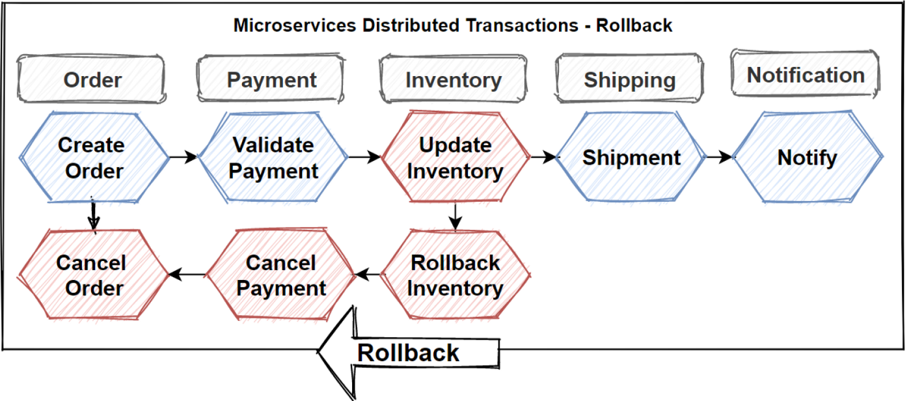
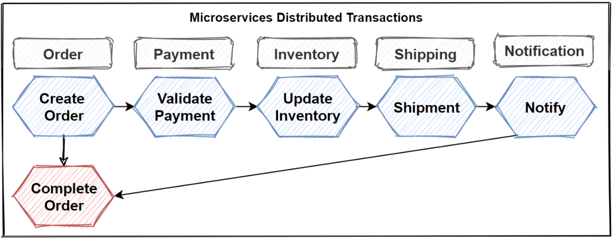
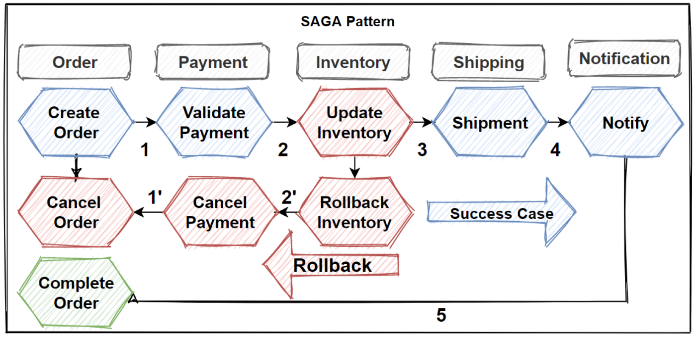
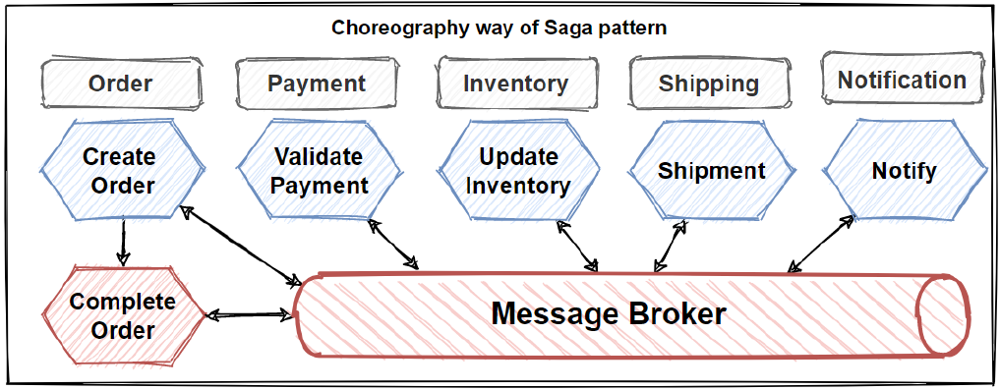
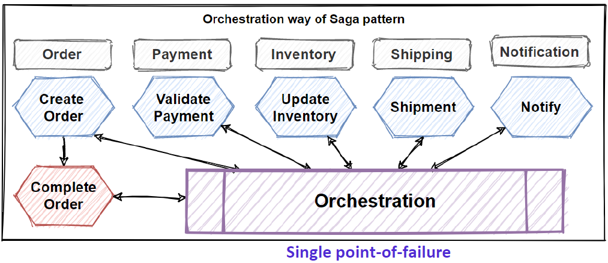
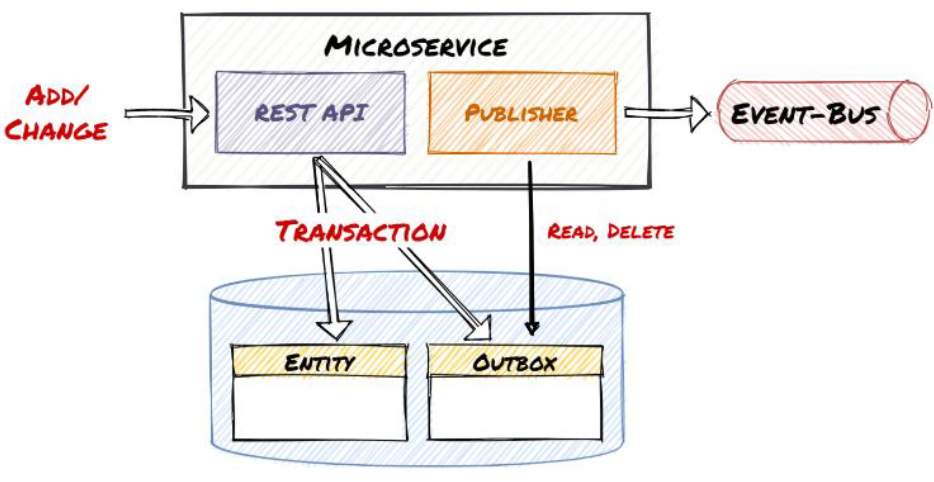

> 翻译自文章: [Microservices Distributed Transactions](https://medium.com/design-microservices-architecture-with-patterns/microservices-distributed-transactions-a71a996e5db8)，作者 [Mehmet Ozkaya](https://medium.com/@mehmetozkaya?source=post_page-----a71a996e5db8--------------------------------)

在这篇文章中，我们将讨论在执行CRUD操作时的微服务分布式事务管理。正如你所知，我们学习了关于微服务数据设计模式的实践和模式，并将它们添加到我们的设计工具箱中。我们将在设计电子商务微服务架构时使用这些模式和实践。

在文章的最后，你将学会如何在微服务架构中应用微服务数据设计模式和原则来管理分布式事务。

## 微服务分布式事务

我们将学习如何跨微服务进行事务性操作，以及我们应该应用哪些模式，我们一起学习。

我们看到，用一些模式来查询跨微服务的数据，这不是一件容易的事情。所以现在我们要学习如何在几个微服务之间实现事务性操作，这是很复杂的。它之所以复杂，是因为在分布式架构上工作，在微服务上使用多语言数据库，自然会引起网络问题。

换句话说，微服务上没有分布式事务管理，我们应该通过手动实现一些模式和实践来处理它。

通常情况下，在单体架构中，数据库是单一的，在数据库层面管理事务和ACID原则，并提供严格的一致性，但当涉及到分布式微服务时，我们主要是在处理最终一致性。

让我们检查一下图片。首先让我谈谈用例。这里的用例是创建订单，或者你可以说是订单履行过程。

在这个订单履行用例中，有5个微服务需要彼此互动，这种互动应该是创建订单的分布式事务。由于每个微服务都有自己的数据库，它们可以用自己的数据库管理内部事务。

但在这个创建订单的过程中，它需要成功地完成所有微服务的内部事务，并按顺序进行。

如果一个微服务出现任何问题，这个过程就应该回滚到所处理的微服务。

这意味着完成其部分工作的微服务应该中止进程，并将其内部操作回滚到各个数据库中。

所以这个创建订单的过程是一个分布式事务，在分布式系统中，我们应该管理这个分布式事务，以保持几个微服务之间的数据一致性。

当然，在实现分布式事务时，我们应该遵循一些模式和原则。让我们看看有哪些模式可以应用于这个问题。

## 分布式事务的Saga模式

saga设计模式是为了在分布式事务的情况下管理跨微服务的数据一致性。基本上，saga模式提供了创建一组事务，按顺序更新微服务。
并发布事件以触发下一个微服务的下一个事务。

如果其中一个步骤失败了，那么 saga 模式就会触发回滚事务，这基本上是通过向以前的微服务发布回滚事件来做反向操作。

通过这种方式，它可以管理跨微服务的分布式交易。正如你所知，它在 Saga 模式中使用了一些原则，如发布/订阅模式与经纪人或API组合模式。

Saga 模式通过使用微服务的本地事务序列来提供事务管理。每个微服务都有自己的数据库，它能够以原子的方式管理本地事务，并具有严格的一致性。

因此，Saga模式将这些本地事务分组，并按顺序逐一调用。每个本地事务都会更新数据库并发布一个事件来触发下一个本地事务。

如果其中一个步骤失败了，那么 saga 模式就会触发回滚事务，这是一组补偿事务，回滚之前微服务上的变化，并恢复数据一致性。

有两种类型的saga实现方式，它们是 "协调（**choreography**）"和 "编排（**orchestration**）"。

让我解释一下Saga模式的协调（**Choreography**）方式。

### 协调 Sage 模式

协调（Choreography）提供了应用发布-订阅原则来协调 saga 的方法。通过编排，每个微服务都运行自己的本地事务，并将事件发布到消息代理系统，从而触发其他微服务的本地事务。

如果简单的工作流程不需要太多的微服务事务步骤，那么这种方式就很适合。

但如果Saga工作流的步骤增加，那么就会变得混乱，难以管理saga微服务之间的事务。同时，在管理事务时，协调（Choreography）的方式也会将微服务的直接依赖关系解耦。

### 编排 saga 模式

另一种 saga 方式是编排（Orchestration）。编排（Orchestration）为协作的saga提供了一个集中式控制器微服务。这个集中的控制器微服务，编排 saga 的工作流程，并按顺序调用执行本地的微服务事务。

编排者微服务执行 saga 事务，并以集中的方式管理它们，如果其中一个步骤失败，则执行带有补偿事务的回滚步骤。

编排（Orchestration）方式对于包括很多步骤的复杂工作流来说是很好的。但是，这使得集中式控制器的微服务会有单点故障问题，并且需要实施复杂的步骤。

### Saga模式的回滚

下面的图片显示了一个使用 Saga 模式的失败事务。

更新库存操作在Inventory微服务中失败了。因此，当它失败到一个步骤时，Saga调用一组补偿事务来回滚库存操作，取消付款和订单，并将每个微服务的数据返回到一个一致的状态。

在分布式微服务架构中使用 saga 模式时，我们应该小心。如果我们的用例要求几个微服务之间的数据一致性，并且要求在其中一个步骤失败时回滚，那么我们应该使用 Saga 模式。

## Outbox 模式

简单地说，当你的 API 发布事件消息时，它并不直接发送它们。相反，这些消息被保存在一个数据库表中。之后，A job在预定的时间间隔内将事件发布到消息代理系统。

基本上，Outbox模式提供了可靠的事件发布。这种方法的想法是在微服务的数据库中有一个 "outbox" 表。

在这种方法中，领域事件不直接写入事件总线。而是写到服务的 "outbox" 角色中的一个表，该表将事件存储在它自己的数据库中。

然而，这里的关键点是，在事件发生前执行的事务和写到 outbox 表中的事件是同一事务的一部分。

例如，当一个新产品被添加到系统中时，添加产品和将 ProductCreated 事件写入 outbox 表的过程在同一个事务中完成，确保事件被保存到数据库中。

第二步是接收这些由独立服务写到 outbox 表中的事件，并将其写入事件总线中。

正如你可以看到上面的图片，订单服务执行他们的用例操作并更新他们自己的表，而不是发布一个事件，它是将这个事件记录写入另一个表，这个事件从另一个服务中读取并发布和事件。

### 为什么我们要使用 Outbox 模式？

如果你正在处理需要一致性的关键数据，并且需要准确地捕捉所有的请求，那么使用 Outbox 模式就很好。如果在你的案例中，数据库的更新和消息的发送应该是原子性的，以确保数据的一致性，那么使用 Outbox 模式就很好。

例如，订单销售事务，已经很清楚这些数据的重要性。因为它们是关于金融业务的。因此，计算必须是100%正确的。

为了能够获得这种准确性，我们必须确保我们的系统不会丢失任何事件信息。所以 outbox 模式应该适用于这种情况。

