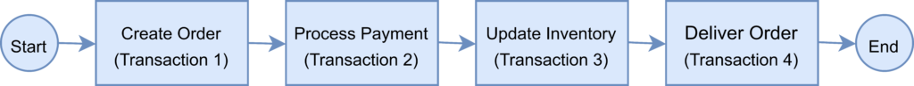
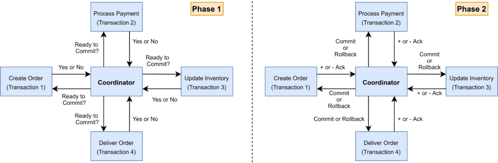

> 文章翻译自：[Saga Pattern in Microservices](https://www.baeldung.com/cs/saga-pattern-microservices)

## 1. 概述

从其核心原则和真实背景来看，基于微服务的应用程序是一个分布式系统。整个系统由多个较小的服务组成，这些服务共同提供整体的应用功能。

尽管这种架构风格提供了许多好处，但它也有一些限制。微服务架构中的一个主要问题是如何处理一个跨多个服务的事务。

在本教程中，我们将探讨 Saga 架构模式，它让我们在微服务架构中管理分布式事务。

## 2. 每服务的数据库模式

微服务架构的好处之一是，我们可以为每个服务选择技术栈。

例如，我们可以决定为服务A使用关系型数据库，为服务B使用NoSQL数据库。

这种模式让服务在最适合其数据类型和模式的数据存储上独立管理领域数据。此外，它还允许服务按需扩展其数据存储，并使其免受其他服务故障的影响。

然而，有时一个事务可能跨多个服务，确保服务数据库的数据一致性是一个挑战。在下一节中，我们将通过一个例子来仔细研究分布式事务管理的挑战。

## 3. 分布式事务

为了演示分布式事务的使用，我们将以一个处理在线订单的电子商务应用程序为例，该应用程序是用微服务架构实现的。

有一个微服务用于创建订单，一个用于处理付款，另一个用于更新库存，最后一个用于交付订单。

这些微服务中的每一个都执行一个本地事务，以实现各个功能。

## 4. 分布式事务的挑战

在上一节中，我们提供了一个分布式事务的真实例子。微服务架构中的分布式事务带来了两个关键挑战。

**第一个挑战是维护ACID**。为了确保事务的正确性，它必须是原子性、一致性、隔离性和持久性（Atomic, Consistent, Isolated and Durable / ACID）。原子性确保交易的所有步骤都完成或没有任何步骤完成。一致性将数据从一个有效状态带到另一个有效状态。隔离性保证了并发的事务应该产生与顺序事务相同的结果。最后，持久性意味着无论任何类型的系统故障，已提交的事务都会继续提交。**在分布式事务的情况下，由于事务跨越了几个服务，确保ACID始终是关键。**

**第二个挑战是管理交易隔离级别**。它规定了当其他服务同时访问相同数据时，事务中可见的数据量。换句话说，如果一个微服务中的一个对象被持久化在数据库中，而另一个请求读取数据，服务应该返回旧的还是新的数据？

## 5. 理解两阶段提交

两阶段提交（2PC）是一种广泛使用的实现分布式事务的模式。我们可以在微服务架构中使用这种模式来实现分布式事务。

在两阶段提交协议中，有一个协调者组件，负责控制事务，并包含管理事务的逻辑。

另一个组件是参与的节点（例如，微服务），它们运行各自的本地事务。

TBD
