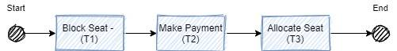
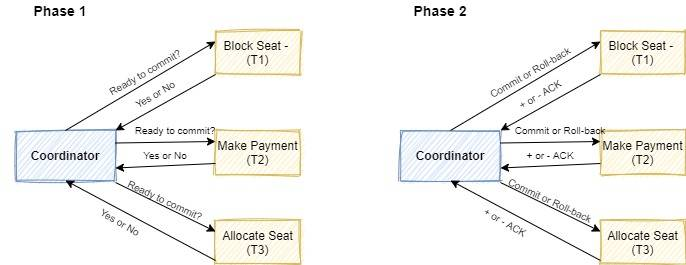
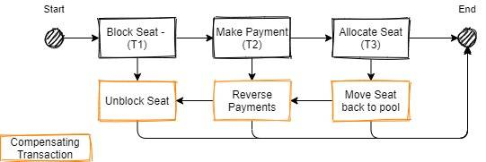
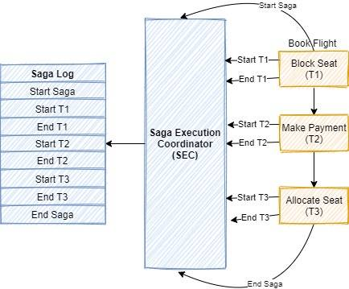
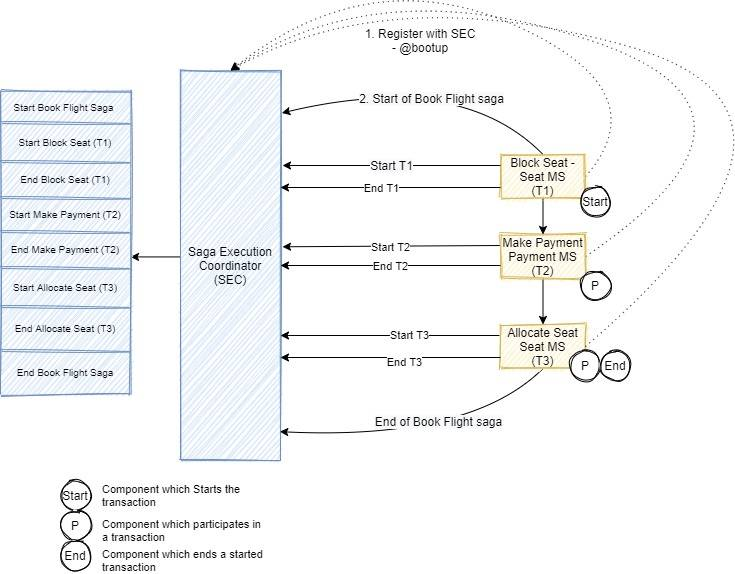
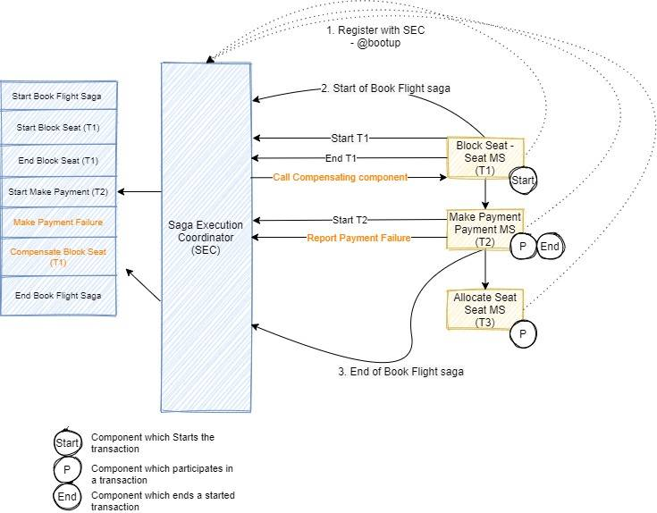
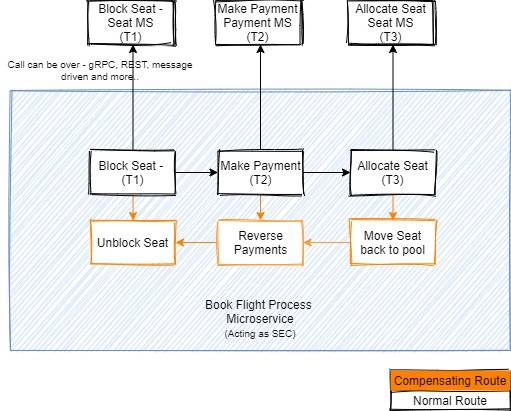

> 文章翻译自：[Solving distributed transaction management problem in microservices architecture using Saga - IBM Developer](https://developer.ibm.com/articles/use-saga-to-solve-distributed-transaction-management-problems-in-a-microservices-architecture/): 2020年9月

在微服务架构中需要解决的问题之一是如何处理跨多个服务的事务。Saga是一种架构模式，它提供了一种优雅的方法来实现跨越多个服务的事务，而且是异步和反应性的。Saga中的每个服务都执行自己的本地事务并发布一个事件。连续的服务监听该事件并执行下一个本地事务。如果一个事务因某种原因而失败，Saga也会执行补偿性事务，以消除前面事务的影响。

## 微服务架构中分布式事务管理的复杂性

微服务，从其核心原则和真实情况来看，是一个分布式系统。一个事务被分布到多个服务中，这些服务被依次或平行地调用以完成整个事务。在微服务架构下，最常见的模式是每微服务的数据库，所以事务也需要跨越不同的数据库。

图1显示了一个使用微服务架构实现的简单航空公司航班预订场景的例子。会有一个微服务来阻止一个座位，另一个微服务来接受付款，最后，另一个微服务来分配被阻止的座位，每个微服务都实现了一个本地事务来实现其功能。为了成功完成旅客的航班预订过程，所有三个步骤都必须完成。如果任何一个步骤失败，所有已完成的前面的步骤都必须回滚。由于整个事务的边界跨越了多个服务和数据库，所以它被认为是一个分布式事务。

图1. 航空公司的航班预订情况

随着微服务架构的出现，在分布式事务管理方面有两个关键问题：

- **如何保持事务的原子性**。原子性意味着事务中的所有步骤都必须成功，或者如果一个步骤失败，那么之前完成的所有步骤都应该回滚。然而，在微服务架构中，一个事务可以由不同的微服务处理的多个本地事务组成。因此，如果其中一个本地事务失败，如何回滚之前完成的成功事务？
- **如何管理并发请求的事务隔离级别**。事务隔离级别规定了事务中语句可见的数据量，特别是当同一数据源被多个服务调用同时访问时。如果任何一个微服务的对象被持久化到数据库，而另一个请求同时读取同一个对象，服务应该返回旧数据还是新数据？

在设计基于微服务的应用程序时，解决这两个问题是至关重要的。以下是解决这些问题的两种方法：

- 两阶段提交（2PC）
- saga

## 两阶段提交（2PC）

两阶段提交是数据库系统中一个众所周知的模式。这种模式也可以用于微服务，实现分布式事务。在两阶段提交中，有一个控制节点，它容纳了大部分的逻辑和参与节点（微服务），在这些节点上执行操作。它分两个阶段工作：

- 准备阶段（第1阶段）：控制节点询问所有的参与节点是否准备好提交。参与的节点以是或否来回应。
- 提交阶段（第2阶段）：如果所有节点的回答都是肯定的，那么控制节点就会要求他们提交。即使有一个节点的回答是否定的，控制节点也会要求他们回滚。

图2. 两阶段提交

即使 2PC 可以帮助提供分布式系统中的事务管理，它也会成为单点故障，因为事务的责任落在协调者身上。随着阶段数的增加，整体性能也会受到影响。由于协调器的喋喋不休，整个系统被最慢的资源所约束，因为任何准备好的节点都要等待较慢的节点的确认。另外，这种协调器的典型实现在本质上是同步的，这可能导致未来的吞吐量减少。2PC仍然有以下缺点：

- 如果一个微服务在提交阶段变得不可用，就没有一个机制来回滚其他事务。
- 其他服务必须等待，直到最慢的服务完成其确认。服务所使用的资源被锁定，直到整个事务完成。
- 由于对事务协调器的依赖，两阶段提交在设计上很慢。这可能会导致可扩展性问题，特别是在基于微服务的应用中和涉及许多服务的回滚场景中。

## saga

正如 Hector Garcia-Molina 和 Kenneth Salem 在1987年计算机协会的文章中所描述的那样，Saga是一个执行特定工作单元的操作序列，通常是相互交错进行的。每一个属于 Saga 的操作都可以通过一个补偿性的动作来回滚。Saga 保证所有的操作都能成功完成，或者为所有执行的操作运行相应的补偿动作，以回滚之前完成的工作。

补偿动作必须是幂等的，必须有重试的能力，直到它被成功执行，本质上使它成为一个不能失败的动作，不需要人工干预来解决它的失败。Saga 执行协调员（Saga Execution Coordinator  / SEC）为整个流程提供了这种保证和能力，使其成为一个要么成功要么中止的事务，并有必要的回滚。

下图显示了如何将上述航班预订场景中的Saga可视化：

图3. sage 流程

### Saga模式如何在分布式事务场景中提供帮助

微服务为管理事务引入了另一组问题，因为每一个领域驱动的服务都是单独部署的，并且是孤立运行的。通过微服务架构，一个业务流程将多个微服务聚集在一起，提供一个整体解决方案。使用微服务架构实现ACID（原子性、一致性、隔离性、持久性）事务是非常困难的，在某些情况下是不可能的。例如，在前面提到的航班预订的例子中，具有站位功能的微服务不能获得支付数据库的锁，因为它在大多数情况下是一个外部服务。但是仍然需要某种形式的事务管理，所以这些事务被称为BASE事务：基本可用性、软状态、最终一致性（Basic Availability, Soft state, Eventual consistency）。必须采取补偿行动，以恢复作为事务的一部分而发生的任何事情。

这就是Saga模式的完美之处，因为它有助于：

- 在多个微服务之间保持数据的一致性，而不需要紧密耦合
- 与 2PC 相比，性能更好
- 无单点故障问题
- 保持事务的整体状态最终一致

### Saga执行协调员

Saga执行协调员（Saga Execution Coordinator / SEC）是成功实施 Saga 流程的核心组件。它维护一个包含特定流程的事件序列的 Saga日志。如果任何一个组件发生故障，SEC 会查询日志，并帮助确定哪些组件受到影响，以及必须执行的补偿交易的顺序。从本质上讲，SEC 有助于保持整个流程的最终一致状态。

如果 SEC 组件本身发生故障，它可以在恢复时读取 SEC 日志，以确定哪些组件被成功回滚，确定哪些组件是待定的，并开始按时间顺序反向调用它们。

图4. Saga执行协调员

## 实现Saga模式的不同方法

有两种合理的方式来实现Saga模式：协调（choreography）和编排（orchestration）。

### 协调（choreography）
在 Saga 协调（choreography）模式中，作为流程一部分的每个单独的微服务都会发布一个事件，并由连续的微服务来接收。你必须在微服务开发生命周期的早期做出决定，了解它是否会成为 Saga 模式的一部分，因为你必须选择一个合适的框架来帮助实现这种模式。为了采用特定的框架代码，微服务必须用注解、类初始化或其他配置变化来装饰。在 Saga 协调（choreography）模式中，SEC可以被嵌入到微服务中，或者在大多数情况下是一个独立的组件。

图5. Saga 协调（choreography）模式的成功场景

每当一个服务出现时，它就向 SEC 注册，这使得它可以成为可能跨越各种微服务的事务的一部分。SEC在其日志中维护事件的顺序，这有助于它对在故障情况下调用的补偿服务和顺序做出决定。下图显示了在故障情况下是如何维护日志的。

图6. Saga 协调（choreography）模式的故障场景

参与的微服务通知 SEC 失败，然后由 SEC 负责回滚所有在它之前完成的其他事务。图中显示，支付微服务失败了，这触发了 SEC 回滚占位服务。如果对占位服务的调用失败，SEC 有责任重试，直到成功。

当你开始你的微服务之旅（基本上是 greenfield 开发），并了解到有必要在适当的时候引入流程微服务时，Saga 协调（choreography）模式是理想的。以下框架可用于实现 Saga 协调（choreography）模式。

- [Eclipse MicroProfile LRA](https://eventuate.io/docs/manual/eventuate-tram/latest/getting-started-eventuate-tram-sagas.html)（Long Running Actions）是 Saga 中分布式事务的一个实现，用于基于REST原则的HTTP传输。目前正在进行候选发布。
- [Eventuate Tram Saga](https://eventuate.io/docs/manual/eventuate-tram/latest/getting-started-eventuate-tram-sagas.html) 是 Spring Boot 和 Micronaut 微服务的 Saga 协调框架，它是基于 Eventuate Tram 框架。
- [Axon Saga](https://docs.axoniq.io/reference-guide/v/3.1/part-ii-domain-logic/sagas) 是一个轻量级框架，通过在架构中直接解决这些问题，帮助你构建可扩展和可延伸的应用程序。Axon Saga 框架的实现可以与大多数 Java 框架集成，实现 Saga 流程。它是基于 Spring Boot 框架的微服务的一个流行选择。
- [Seata](http://seata.io/en-us/docs/dev/mode/saga-mode.html) 是一个开源的分布式事务解决方案，致力于提供高性能和易于使用的分布式事务服务。Seata 也能很好地与大多数 Java 框架集成，并被阿里巴巴推广用于解决他们的分布式事务问题。

### 编排（orchestration）

正如 Saga 编排（orchestration）模式的名称所示，有一个单一的编排器组件负责管理整个流程。如果流程在调用任何单个微服务时遇到错误，那么它也负责调用补偿服务。编排器帮助对 Saga 流程进行建模，但也依赖于底层框架来依次调用服务，并在任何服务失败时进行补偿调用。

在下图中，预定航班过程的微服务封装了对各种微服务的调用，以一个特定的顺序进行。如果这些调用中的任何一个失败了，那么通过调用这些微服务的补偿性动作来回滚。

图7. Saga  编排（orchestration）模式

Saga 编排（orchestration）模式非常适合于这样的场景：你已经建立了你的微服务，现在想用这些微服务创建一个流程。必须有一个可用的补偿服务，而且不需要添加另一块代码。这与 Saga 协调（choreography）模式不同，在 Saga 协调（choreography）模式中，你必须将代码与你选择的框架对齐，以实现 Saga。

以下框架可用于实现 Saga 编排（orchestration）模式。

- [Camunda](https://camunda.com/) 是一个基于 Java 的框架，支持工作流和流程自动化的业务流程模型和符号（BPMN）标准。
- [Apache Camel](https://camel.apache.org/components/latest/eips/saga-eip.html) 为 Saga EIP（企业集成模式）提供了实现，这是一种在 Camel 路由中定义一系列相关行动的方式，这些行动要么成功完成（所有的），要么不执行或补偿。
- [IBM App Connect](https://www.ibm.com/cloud/app-connect) 允许你使用各种内置适配器绘制出一个流程，并适当配置其属性，以创建一个 Saga 流程。

## 总结

在微服务的世界里，每个微服务都有自己的数据存储，要保持数据的一致性是很复杂和困难的。Saga 是实现 BASE 事务和确保分布式架构中数据最终一致性的最佳方式之一。Saga 的最佳实施需要业务和开发团队改变思维方式。
